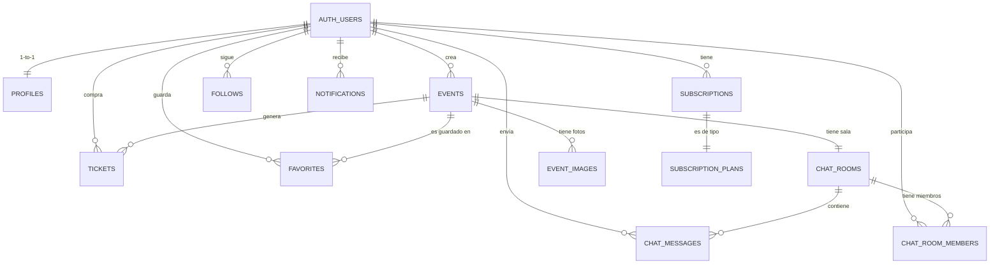

# 🗄️ Eventia — Flujo Completo de Base de Datos

> Análisis basado en el código fuente real del proyecto (`/src/pages`, `/src/types`, `database_schema.sql`, `PRD.md`).

---

## 📐 Diagrama de Relaciones (ERD)



---

## 🏗️ Tablas Requeridas

### 1. `profiles` — Perfil del usuario
> Creada en `AuthPage.tsx` (upsert al registrar) y `OnboardingPage.tsx` (upsert de preferencias).

| Columna | Tipo | Descripción |
|---|---|---|
| `id` | `UUID PK` | Mismo ID de `auth.users` |
| `full_name` | `TEXT` | Nombre completo |
| `avatar_url` | `TEXT` | URL de foto de perfil |
| `phone` | `TEXT` | Teléfono (opcional) |
| `location` | `TEXT` | Ciudad/ubicación del usuario |
| `bio` | `TEXT` | Descripción personal |
| `role` | `TEXT` | `'user'` \| `'premium'` \| `'organizer'` \| `'admin'` |
| `preferences` | `JSONB` | Array de categorías favoritas, ej: `["música","arte"]` |
| `preferred_entry_type` | `TEXT` | `'gratis'` \| `'pago'` \| `'ambas'` |
| `tags` | `JSONB` | Tags de interés mostrados en perfil de chat |
| `events_count` | `INTEGER` | Eventos creados (desnormalizado) |
| `followers_count` | `INTEGER` | Seguidores (desnormalizado) |
| `onboarding_complete` | `BOOLEAN` | Si completó el onboarding |
| `updated_at` | `TIMESTAMPTZ` | Última actualización |

**Flujo:** `auth.signUp` → trigger crea `profiles` básico → `/onboarding` hace `upsert` con `preferences` + `preferred_entry_type`.

---

### 2. `events` — Eventos
> Campos de `CreateEventPage.tsx` y `EventData` en `types/index.ts`.

| Columna | Tipo | Descripción |
|---|---|---|
| `id` | `UUID PK` | ID único del evento |
| `created_at` | `TIMESTAMPTZ` | Fecha de creación |
| `title` | `TEXT NOT NULL` | Nombre del evento |
| `description` | `TEXT` | Descripción larga |
| `category` | `TEXT NOT NULL` | Categoría (`música`, `arte`, etc.) |
| `date` | `DATE NOT NULL` | Fecha del evento |
| `time` | `TIME NOT NULL` | Hora del evento |
| `location` | `TEXT NOT NULL` | Dirección o lugar |
| `latitude` | `FLOAT8` | Coordenada GPS (para mapa) |
| `longitude` | `FLOAT8` | Coordenada GPS (para mapa) |
| `price` | `NUMERIC(10,2)` | Precio en USD (`0` = gratis) |
| `currency` | `TEXT DEFAULT 'USD'` | Moneda |
| `max_attendees` | `INTEGER` | Aforo máximo |
| `attendees_count` | `INTEGER DEFAULT 0` | Asistentes actuales (desnormalizado) |
| `image_url` | `TEXT` | Imagen de portada |
| `emoji` | `TEXT` | Emoji de categoría |
| `amenities` | `JSONB DEFAULT '[]'` | Servicios: `["wifi","parking","food"]` |
| `tags` | `JSONB DEFAULT '[]'` | Tags del evento |
| `status` | `TEXT DEFAULT 'active'` | `'active'` \| `'cancelled'` \| `'finished'` |
| `is_featured` | `BOOLEAN DEFAULT false` | Destacado en mapa (plan Business) |
| `organizer_id` | `UUID FK → auth.users` | Organizador |
| `organizer_name` | `TEXT` | Nombre (desnormalizado) |

---

### 3. `event_images` — Fotos extra del evento
> El formulario de `CreateEventPage.tsx` permite subir galería de imágenes extras.

| Columna | Tipo | Descripción |
|---|---|---|
| `id` | `UUID PK` | — |
| `event_id` | `UUID FK → events` | Evento relacionado |
| `url` | `TEXT NOT NULL` | URL en Supabase Storage |
| `order` | `INTEGER DEFAULT 0` | Orden de visualización |
| `created_at` | `TIMESTAMPTZ` | — |

---

### 4. `tickets` — Tickets comprados
> Usado en `MyTicketsPage.tsx` y `TicketDetailsPage.tsx`.

| Columna | Tipo | Descripción |
|---|---|---|
| `id` | `UUID PK` | ID del ticket |
| `created_at` | `TIMESTAMPTZ` | Fecha de compra |
| `user_id` | `UUID FK → auth.users` | Comprador |
| `event_id` | `UUID FK → events` | Evento |
| `quantity` | `INTEGER DEFAULT 1` | Cantidad de entradas |
| `unit_price` | `NUMERIC(10,2)` | Precio unitario al momento de compra |
| `total_price` | `NUMERIC(10,2)` | Precio total |
| `status` | `TEXT DEFAULT 'active'` | `'active'` \| `'used'` \| `'cancelled'` |
| `qr_code` | `TEXT` | Código QR generado |
| `seat_info` | `TEXT` | Info de asiento (opcional) |

---

### 5. `favorites` — Eventos guardados
> Usado en `FavoritesPage.tsx` y `EventDetailPage.tsx`.

| Columna | Tipo | Descripción |
|---|---|---|
| `id` | `UUID PK` | — |
| `created_at` | `TIMESTAMPTZ` | — |
| `user_id` | `UUID FK → auth.users` | Usuario |
| `event_id` | `UUID FK → events` | Evento guardado |

**Constraint:** `UNIQUE(user_id, event_id)`

---

### 6. `subscriptions` — Membresías/Suscripciones
> Planes en `PremiumPage.tsx`: `Basic`, `Pro ($9.99)`, `Business ($29.99)`.

| Columna | Tipo | Descripción |
|---|---|---|
| `id` | `UUID PK` | — |
| `created_at` | `TIMESTAMPTZ` | Fecha de suscripción |
| `user_id` | `UUID FK → auth.users` | Usuario |
| `plan_id` | `TEXT NOT NULL` | `'Basic'` \| `'Pro'` \| `'Business'` |
| `status` | `TEXT DEFAULT 'active'` | `'active'` \| `'cancelled'` \| `'expired'` |
| `price_paid` | `NUMERIC(10,2)` | Precio pagado |
| `billing_period` | `TEXT DEFAULT 'monthly'` | `'monthly'` \| `'yearly'` |
| `started_at` | `TIMESTAMPTZ` | Inicio del período |
| `expires_at` | `TIMESTAMPTZ` | Expiración |
| `payment_reference` | `TEXT` | Referencia de pago externo |

> [!IMPORTANT]
> Al activar un plan `Business`, un trigger debe actualizar `profiles.role = 'organizer'` para desbloquear `CreateEventPage`.

---

### 7. `chat_rooms` — Salas de chat
> Cada evento tiene una sala de chat (`ChatPage.tsx`, `ChatRoomPage.tsx`).

| Columna | Tipo | Descripción |
|---|---|---|
| `id` | `UUID PK` | — |
| `created_at` | `TIMESTAMPTZ` | — |
| `name` | `TEXT NOT NULL` | Nombre de la sala |
| `event_id` | `UUID FK → events NULL` | Evento relacionado (null = chat privado) |
| `type` | `TEXT DEFAULT 'event'` | `'event'` \| `'private'` |
| `last_message` | `TEXT` | Último mensaje (desnormalizado) |
| `last_message_at` | `TIMESTAMPTZ` | Hora del último mensaje |
| `participants_count` | `INTEGER DEFAULT 0` | Participantes |

---

### 8. `chat_room_members` — Miembros de salas
> Controla quién está en cada sala y cuántos mensajes no ha leído.

| Columna | Tipo | Descripción |
|---|---|---|
| `id` | `UUID PK` | — |
| `room_id` | `UUID FK → chat_rooms` | Sala |
| `user_id` | `UUID FK → auth.users` | Miembro |
| `joined_at` | `TIMESTAMPTZ` | Cuándo se unió |
| `last_read_at` | `TIMESTAMPTZ` | Último mensaje leído |
| `unread_count` | `INTEGER DEFAULT 0` | Mensajes no leídos |

**Constraint:** `UNIQUE(room_id, user_id)`

---

### 9. `chat_messages` — Mensajes
> Estructura derivada de `ChatRoomPage.tsx` (mensajes, reply, imágenes, video).

| Columna | Tipo | Descripción |
|---|---|---|
| `id` | `UUID PK` | — |
| `created_at` | `TIMESTAMPTZ` | Timestamp del mensaje |
| `room_id` | `UUID FK → chat_rooms` | Sala de chat |
| `sender_id` | `UUID FK → auth.users` | Remitente |
| `text` | `TEXT` | Texto del mensaje (nullable) |
| `images` | `JSONB DEFAULT '[]'` | URLs de imágenes adjuntas |
| `video_url` | `TEXT` | URL de video adjunto |
| `reply_to_id` | `UUID FK → chat_messages NULL` | Mensaje al que responde |
| `is_deleted` | `BOOLEAN DEFAULT false` | Eliminado por el autor |

---

### 10. `notifications` — Notificaciones
> Tipos en `NotificationsPage.tsx`: `event`, `ticket`, `chat`, `system`.

| Columna | Tipo | Descripción |
|---|---|---|
| `id` | `UUID PK` | — |
| `created_at` | `TIMESTAMPTZ` | — |
| `user_id` | `UUID FK → auth.users` | Destinatario |
| `title` | `TEXT NOT NULL` | Título |
| `message` | `TEXT NOT NULL` | Cuerpo de la notificación |
| `type` | `TEXT NOT NULL` | `'event'` \| `'ticket'` \| `'chat'` \| `'system'` |
| `read` | `BOOLEAN DEFAULT false` | ¿Fue leída? |
| `action_url` | `TEXT` | Ruta a la que navegar al pulsar |
| `related_id` | `UUID` | ID del evento/ticket/chat relacionado |

---

### 11. `follows` — Seguimiento entre usuarios
> La pantalla `ChatRoomPage.tsx` permite seguir usuarios desde el perfil del chat.

| Columna | Tipo | Descripción |
|---|---|---|
| `id` | `UUID PK` | — |
| `created_at` | `TIMESTAMPTZ` | — |
| `follower_id` | `UUID FK → auth.users` | Quien sigue |
| `following_id` | `UUID FK → auth.users` | A quien se sigue |

**Constraint:** `UNIQUE(follower_id, following_id)` + `CHECK (follower_id <> following_id)`

---

## 🔐 Políticas RLS Completas

```sql
-- PROFILES
ALTER TABLE profiles ENABLE ROW LEVEL SECURITY;
CREATE POLICY "Perfiles públicos"      ON profiles FOR SELECT USING (true);
CREATE POLICY "Insertar propio perfil" ON profiles FOR INSERT WITH CHECK (auth.uid() = id);
CREATE POLICY "Actualizar propio perfil" ON profiles FOR UPDATE USING (auth.uid() = id);

-- EVENTS
ALTER TABLE events ENABLE ROW LEVEL SECURITY;
CREATE POLICY "Eventos visibles"       ON events FOR SELECT USING (true);
CREATE POLICY "Solo organizer crea"    ON events FOR INSERT WITH CHECK (auth.uid() = organizer_id);
CREATE POLICY "Solo organizer edita"   ON events FOR UPDATE USING (auth.uid() = organizer_id);
CREATE POLICY "Solo organizer elimina" ON events FOR DELETE USING (auth.uid() = organizer_id);

-- TICKETS
ALTER TABLE tickets ENABLE ROW LEVEL SECURITY;
CREATE POLICY "Ver propios tickets"    ON tickets FOR SELECT USING (auth.uid() = user_id);
CREATE POLICY "Comprar tickets"        ON tickets FOR INSERT WITH CHECK (auth.uid() = user_id);
CREATE POLICY "Cancelar ticket"        ON tickets FOR UPDATE USING (auth.uid() = user_id);

-- FAVORITES
ALTER TABLE favorites ENABLE ROW LEVEL SECURITY;
CREATE POLICY "Ver propios favoritos"  ON favorites FOR SELECT USING (auth.uid() = user_id);
CREATE POLICY "Añadir favorito"        ON favorites FOR INSERT WITH CHECK (auth.uid() = user_id);
CREATE POLICY "Quitar favorito"        ON favorites FOR DELETE USING (auth.uid() = user_id);

-- CHAT_MESSAGES
ALTER TABLE chat_messages ENABLE ROW LEVEL SECURITY;
CREATE POLICY "Ver mensajes de sala"   ON chat_messages FOR SELECT
  USING (EXISTS (SELECT 1 FROM chat_room_members WHERE room_id = chat_messages.room_id AND user_id = auth.uid()));
CREATE POLICY "Enviar mensajes"        ON chat_messages FOR INSERT
  WITH CHECK (auth.uid() = sender_id);
CREATE POLICY "Eliminar propios msg"   ON chat_messages FOR UPDATE
  USING (auth.uid() = sender_id);

-- NOTIFICATIONS
ALTER TABLE notifications ENABLE ROW LEVEL SECURITY;
CREATE POLICY "Ver propias notif"      ON notifications FOR SELECT USING (auth.uid() = user_id);
CREATE POLICY "Actualizar propias"     ON notifications FOR UPDATE USING (auth.uid() = user_id);

-- SUBSCRIPTIONS
ALTER TABLE subscriptions ENABLE ROW LEVEL SECURITY;
CREATE POLICY "Ver propia suscripción" ON subscriptions FOR SELECT USING (auth.uid() = user_id);
```

---

## ⚙️ Triggers Necesarios

### Trigger 1 — Crear perfil al registrarse
```sql
CREATE OR REPLACE FUNCTION handle_new_user()
RETURNS TRIGGER AS $$
BEGIN
  INSERT INTO public.profiles (id, full_name, role, onboarding_complete)
  VALUES (
    NEW.id,
    NEW.raw_user_meta_data->>'full_name',
    'user',
    false
  );
  RETURN NEW;
END;
$$ LANGUAGE plpgsql SECURITY DEFINER;

CREATE TRIGGER on_auth_user_created
  AFTER INSERT ON auth.users
  FOR EACH ROW EXECUTE FUNCTION handle_new_user();
```

### Trigger 2 — Actualizar rol al activar suscripción Business
```sql
CREATE OR REPLACE FUNCTION handle_subscription_change()
RETURNS TRIGGER AS $$
BEGIN
  IF NEW.status = 'active' AND NEW.plan_id = 'Business' THEN
    UPDATE public.profiles SET role = 'organizer' WHERE id = NEW.user_id;
  ELSIF NEW.status IN ('cancelled', 'expired') THEN
    UPDATE public.profiles SET role = 'user' WHERE id = NEW.user_id;
  END IF;
  RETURN NEW;
END;
$$ LANGUAGE plpgsql SECURITY DEFINER;

CREATE TRIGGER on_subscription_change
  AFTER INSERT OR UPDATE ON public.subscriptions
  FOR EACH ROW EXECUTE FUNCTION handle_subscription_change();
```

### Trigger 3 — Crear sala de chat al crear evento
```sql
CREATE OR REPLACE FUNCTION handle_new_event()
RETURNS TRIGGER AS $$
BEGIN
  INSERT INTO public.chat_rooms (name, event_id, type)
  VALUES (NEW.title || ' — Chat', NEW.id, 'event');
  RETURN NEW;
END;
$$ LANGUAGE plpgsql SECURITY DEFINER;

CREATE TRIGGER on_event_created
  AFTER INSERT ON public.events
  FOR EACH ROW EXECUTE FUNCTION handle_new_event();
```

### Trigger 4 — Incrementar `attendees_count` al comprar ticket
```sql
CREATE OR REPLACE FUNCTION handle_new_ticket()
RETURNS TRIGGER AS $$
BEGIN
  UPDATE public.events
  SET attendees_count = attendees_count + NEW.quantity
  WHERE id = NEW.event_id;
  RETURN NEW;
END;
$$ LANGUAGE plpgsql SECURITY DEFINER;

CREATE TRIGGER on_ticket_purchased
  AFTER INSERT ON public.tickets
  FOR EACH ROW EXECUTE FUNCTION handle_new_ticket();
```

---

## 🔄 Flujo de Datos por Pantalla

| Pantalla | Operación | Tabla(s) involucrada(s) |
|---|---|---|
| `/welcome` | — | — |
| `/auth` (login) | `signInWithPassword` → check `profiles.preferences` | `auth.users`, `profiles` |
| `/auth` (registro) | `signUp` → `upsert profiles` | `auth.users`, `profiles` |
| `/onboarding` | `upsert profiles` (preferences, entry_type) | `profiles` |
| `/` (Home) | `SELECT events` filtrado por preferencias | `events`, `profiles` |
| `/explore` | `SELECT events` con filtros/búsqueda | `events` |
| `/event/:id` | `SELECT event`, check `favorites`, `tickets` | `events`, `favorites`, `tickets` |
| `/checkout/:id` | `INSERT tickets` | `tickets`, `events` |
| `/tickets` | `SELECT tickets JOIN events` | `tickets`, `events` |
| `/ticket/:id` | `SELECT ticket + event` | `tickets`, `events` |
| `/favorites` | `SELECT favorites JOIN events` | `favorites`, `events` |
| `/create` | `INSERT events + event_images` | `events`, `event_images` |
| `/my-events` | `SELECT events WHERE organizer_id = user` | `events` |
| `/chat` | `SELECT chat_rooms JOIN chat_room_members` | `chat_rooms`, `chat_room_members` |
| `/chat/:id` | `SELECT/INSERT chat_messages` (Realtime) | `chat_messages`, `chat_rooms` |
| `/profile` | `SELECT profiles + events + tickets` | `profiles`, `events`, `tickets` |
| `/profile/edit` | `UPDATE profiles` | `profiles` |
| `/notifications` | `SELECT notifications WHERE user_id` | `notifications` |
| `/premium` | `SELECT subscriptions WHERE user_id` | `subscriptions` |
| `/subscribe/:planId` | `INSERT subscriptions` | `subscriptions` |
| `/settings` | `UPDATE profiles`, `supabase.auth.updateUser` | `profiles`, `auth.users` |

---

## 📦 Supabase Storage Buckets

| Bucket | Uso | Acceso |
|---|---|---|
| `avatars` | Fotos de perfil de usuario | Público |
| `event-images` | Portada y galería de eventos | Público |
| `chat-attachments` | Imágenes y videos del chat | Privado (solo miembros de sala) |

---

## ⚡ Funciones en Tiempo Real (Realtime)

Habilitar en Supabase Dashboard → Database → Replication:

| Tabla | Canal | Para qué |
|---|---|---|
| `chat_messages` | `room:{room_id}` | Chat en tiempo real |
| `notifications` | `user:{user_id}` | Notificaciones push |
| `events` | `events` | Actualizaciones de aforo |

---

## ✅ Columnas Faltantes vs Schema Actual

El `database_schema.sql` actual **ya tiene** lo básico. Lo que falta añadir:

```sql
-- En profiles:
ALTER TABLE profiles ADD COLUMN IF NOT EXISTS bio TEXT;
ALTER TABLE profiles ADD COLUMN IF NOT EXISTS role TEXT DEFAULT 'user';
ALTER TABLE profiles ADD COLUMN IF NOT EXISTS preferences JSONB DEFAULT '[]';
ALTER TABLE profiles ADD COLUMN IF NOT EXISTS preferred_entry_type TEXT DEFAULT 'ambas';
ALTER TABLE profiles ADD COLUMN IF NOT EXISTS tags JSONB DEFAULT '[]';
ALTER TABLE profiles ADD COLUMN IF NOT EXISTS followers_count INTEGER DEFAULT 0;
ALTER TABLE profiles ADD COLUMN IF NOT EXISTS events_count INTEGER DEFAULT 0;
ALTER TABLE profiles ADD COLUMN IF NOT EXISTS onboarding_complete BOOLEAN DEFAULT false;

-- En events:
ALTER TABLE events ADD COLUMN IF NOT EXISTS latitude FLOAT8;
ALTER TABLE events ADD COLUMN IF NOT EXISTS longitude FLOAT8;
ALTER TABLE events ADD COLUMN IF NOT EXISTS max_attendees INTEGER;
ALTER TABLE events ADD COLUMN IF NOT EXISTS status TEXT DEFAULT 'active';
ALTER TABLE events ADD COLUMN IF NOT EXISTS is_featured BOOLEAN DEFAULT false;
ALTER TABLE events ADD COLUMN IF NOT EXISTS tags JSONB DEFAULT '[]';
ALTER TABLE events ADD COLUMN IF NOT EXISTS emoji TEXT;

-- Nuevas tablas:
-- event_images, chat_rooms, chat_room_members, chat_messages,
-- subscriptions, follows, notifications
```
